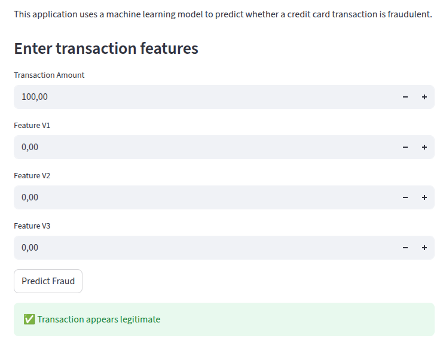

# 💳 Fraud Detection ML System

This project builds a machine learning (ML) system capable of detecting fraudulent credit card transactions.

The system includes:

- Exploratory Data Analysis (EDA)
- Machine Learning model training
- REST API for predictions
- Interactive dashboard for fraud detection

---

## Project Structure

```
fraud-detection-ml
│
├── api
│   └── main.py              # FastAPI prediction service
│
├── app
│   └── app.py               # Streamlit dashboard
│
├── data
│   └── creditcard.csv
│
├── models
│   └── fraud_model.pkl
│
├── notebooks
│   └── exploration.ipynb
│
├── src
│   └── train_model.py
│
├── requirements.txt
└── README.md
```


---

## Dataset

The dataset used in this project contains anonymized credit card transactions labeled as fraudulent or legitimate.

Target variable:

Class  
0 → legitimate transaction  
1 → fraud

---

## Exploratory Data Analysis

The exploratory data analysis (EDA) investigates the structure and characteristics of the dataset.

The analysis includes:

- dataset structure inspection
- missing values analysis
- class imbalance visualization
- transaction amount distribution
- feature correlation heatmap

Full analysis available in the notebook →notebooks/exploration.ipynb

Full notebook → [Exploratory Data Analysis](notebooks/exploration.ipynb)

---

## Model Training

The training pipeline includes:

1. Loading dataset
2. Feature/target separation
3. Train-test split
4. RandomForest model training
5. Model evaluation
6. Saving trained model

Script: src/train_model.py


---

## API

A REST API was implemented using FastAPI.

Start the API: uvicorn api.main:app --reload


API documentation: http://127.0.0.1:8000/docs

Endpoint: POST /predict


---

## Interactive Dashboard

A Streamlit application allows testing the model interactively.

Run the dashboard: streamlit run app/app.py

---
## Transaction Amount Distribution



## Technologies Used

- Python
- Scikit-learn
- FastAPI
- Streamlit
- Pandas
- NumPy

---

## Future Improvements

- Handle class imbalance (SMOTE)
- Model hyperparameter tuning
- Model monitoring
- Cloud deployment

---
## ‍👩🏼‍💻 Author

**Oliveira Mônica**

* 💻 Software Developer transitioning into AI/ML
* ☕ Passionate about code and coffee

---

## ⭐ If you like this project

Give it a star on GitHub ⭐ and feel free to contribute!